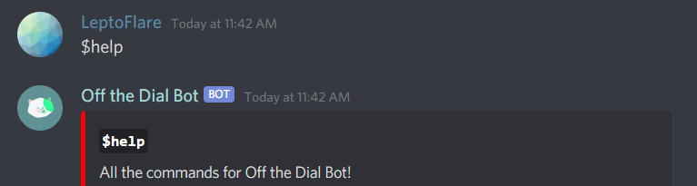

# `offthedialbot`
> A polished bot for the Off the Dial discord server.

![License][license-shield]
![Stars][stars-shield]
![CI][ci-shield]
# 

This bot was created to help organize Off The Dial's tournaments easier and faster. It includes many commands that automate previously manual tasks. Another reason was the lack of a tournament managing discord bot in general. This bot also gets realtime data from start.gg's API.
- Realtime data using start.gg's GraphQL API!
- Unique, polished UI for discord commands!

## Usage


## Contributing
1. Fork the repository and clone it.
2. Make a new branch to submit your pull request from.

### Running locally
1. Create a `config.yml` in the repository root:
   ```
   token: XlcL5cwQ...haJQLQ5G
   smashgg: 7e5073d2c...f61fbea
   debug (optional): true
   ```
3. Go to a Firebase > Project settings > Service accounts > Generate new private key.
   - Rename the file to `service_account.json` and move it into the repository root directory.
5. Run `docker-compose up --build` in the repository root.

### Adding new maps
1. Go to https://github.com/offthedial/bot/blob/master/offthedialbot/commands/to/maplist.py#L80
2. Add the new map names to the list, in the correct order

## Support the Project
This service is partly run using Digital Ocean. If you're planning to use Digital Ocean in the future, we would greatly appricate if you could use our referal button as it will support us with the finacial cost of running the bot. Thank you so much!

[](https://www.digitalocean.com/?refcode=39ab0c6c6e47&utm_campaign=Referral_Invite&utm_medium=Referral_Program&utm_source=badge)

---

Contact me · [**@LeptoFlare**](https://github.com/LeptoFlare) · [lepto.tech](https://lepto.tech)

As always, distributed under the MIT license. See `LICENSE` for more information.

_[https://github.com/offthedial/bot](https://github.com/offthedial/bot)_

<!-- markdown links & imgs -->
[stars-shield]: https://img.shields.io/github/stars/offthedial/bot.svg?style=social
[license-shield]: https://img.shields.io/github/license/offthedial/bot.svg?style=flat
[ci-shield]: https://github.com/offthedial/bot/workflows/Continuous%20Integration/badge.svg
