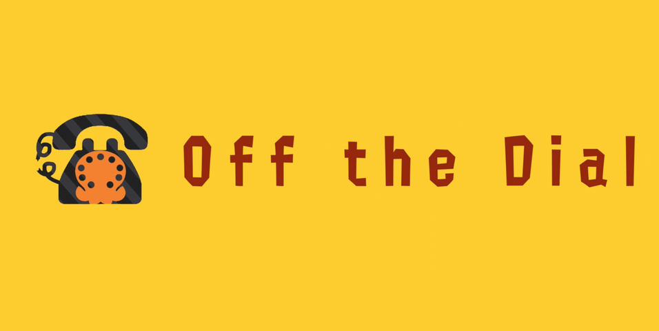

# `offthedialbot`
> A polished bot for the Off the Dial discord server.

![Tags][tag-image]

This bot was created to help organize Off The Dial's tournaments easier and faster. It includes many commands that automate previously manual tasks. Another reason was the lack of a tournament managing discord bot in general. This bot also gets realtime data from smash.gg's API.

[](https://discord.gg/xWkx8SZ)

## Features
- Realtime data using smash.gg's GraphQL API!
- Unique, polished UI for discord commands!

<!--
## Usage
![Example Output][example-output] <!-- Picture of someone using the help command -->

## Development Enviroment
1. Clone the repo `git clone https://github.com/LeptoSpira/rw-offthedialbot.git`
2. Create a `.env` with your discord bot token:
   ```
   token=90c3f4ce...d3123c42
   ```

## Footnote
Find me - Discord: [`https://discord.gg/faUNrfP`](https://discord.gg/faUNrfP)  
Support me - Patreon: [`https://www.patreon.com/leptospira`](https://www.patreon.com/leptospira)  

As always, distributed under the MIT license. See `LICENSE` for more information.

**[https://github.com/LeptoSpira/rw-offthedialbot](https://github.com/LeptoSpira/)**

<!-- Markdown link & img dfn's -->
[tag-image]: https://img.shields.io/github/license/LeptoSpira/rw-offthedialbot.svg
[example-output]: https://github.com/LeptoSpira/rw-offthedialbot/example-output.png
